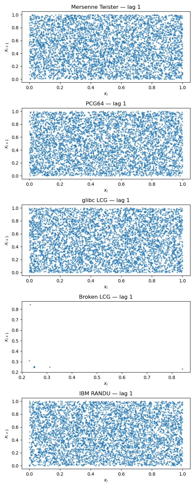
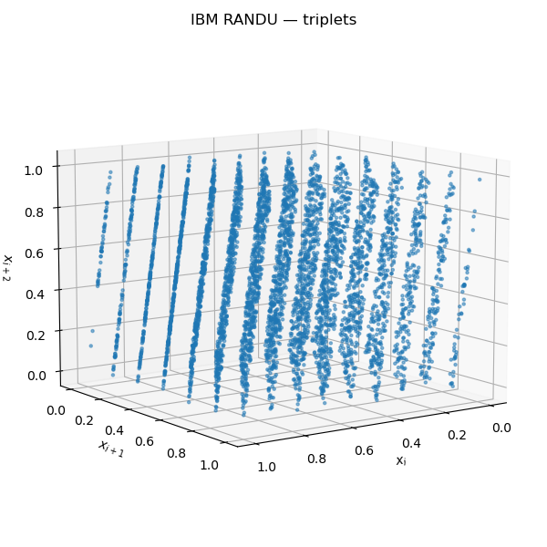

# Program output for 4b):

<pre>
+---------------------------------+----------------+-----------------------------+------------------------------------------+---------------------------------------+
| Name                            | |E[X] - 0.5|   | |Var[X] - 1.0 / sqrt(12)|   | |P[X_i >= 0.5 | X_{i-1} <= 0.5] - 0.5|   | Empty Bins Fraction Where Exp. is 0   |
+=================================+================+=============================+==========================================+=======================================+
| Mersenne Twister                | 2.9e-04        | 6.4e-05                     | 5.5e-04                                  | 1.1e-05 †                             |
+---------------------------------+----------------+-----------------------------+------------------------------------------+---------------------------------------+
| Permuted congruential generator | 3.7e-05 *      | 3.0e-05 *                   | 5.9e-04                                  | 1.1e-05 †                             |
+---------------------------------+----------------+-----------------------------+------------------------------------------+---------------------------------------+
| GLIBC LCG                       | 3.0e-04        | 6.6e-05                     | 1.0e-03 †                                | 0.0e+00 *                             |
+---------------------------------+----------------+-----------------------------+------------------------------------------+---------------------------------------+
| IBM RANDU                       | 3.5e-04 †      | 1.1e-04 †                   | 2.7e-04 *                                | 1.1e-05 †                             |
+---------------------------------+----------------+-----------------------------+------------------------------------------+---------------------------------------+
</pre>

# Program output for 4c):

