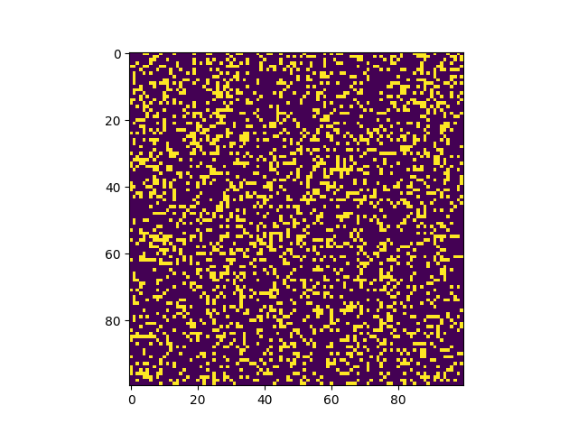
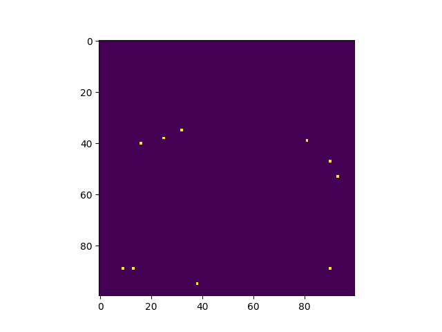
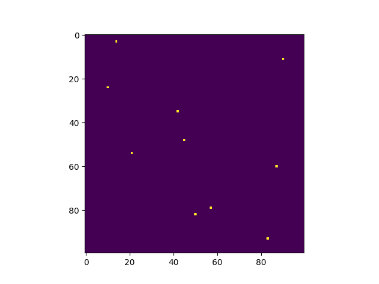

# Results for question `3)`:
<pre>
n=   100: est=0.580000, theo=0.607927, error=0.027927
n=  1000: est=0.597000, theo=0.607927, error=0.010927
n= 10000: est=0.608600, theo=0.607927, error=0.000673
n=100000: est=0.609730, theo=0.607927, error=0.001803
</pre>

# Results for question `4)`:

## Visualizations:
### Example Function

### Uniform Sample Points

### Blocked/Stratified Sample Points

## Numeric comparisons:
<pre>
N=100000000, n=100, repeats=100
Algorithm         RMSE    Result  Best %
-------------  -------  --------  --------
Ground truth   0         0.25     -
Deterministic  0.25      0.25     0.00%
Naive MC       0.04525   0.037    37.00%
Blocked MC     0.0437    0.0338   40.00%
Fancy MC       0.04716   0.03882  23.00%

N=100000000, n=1000, repeats=100
Algorithm         RMSE    Result  Best %
-------------  -------  --------  --------
Ground truth   0        0.25      -
Deterministic  0.25     0.25      0.00%
Naive MC       0.01234  0.009951  40.00%
Blocked MC     0.01391  0.01133   31.00%
Fancy MC       0.01612  0.01288   29.00%

N=100000000, n=10000, repeats=100
Algorithm          RMSE    Result  Best %
-------------  --------  --------  --------
Ground truth   0         0.25      -
Deterministic  0.25      0.25      0.00%
Naive MC       0.004626  0.003712  32.00%
Blocked MC     0.004466  0.003472  40.00%
Fancy MC       0.005455  0.004416  28.00%

N=100000000, n=100000, repeats=100
Algorithm          RMSE    Result  Best %
-------------  --------  --------  --------
Ground truth   0         0.25      -
Deterministic  0.2497    0.2497    0.00%
Naive MC       0.001345  0.001002  47.00%
Blocked MC     0.001476  0.001206  34.00%
Fancy MC       0.001708  0.001435  19.00%
</pre>